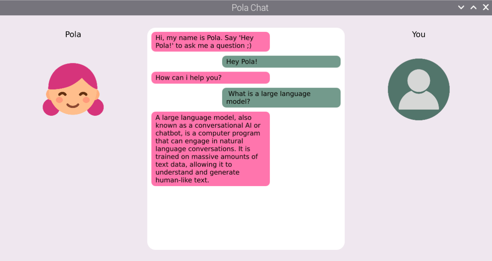

# 🎙️Hey Pola: Voice Assistant

Pola is a program developed for the Embedded Multimedia Course of the Ruhr-Universität Bochum. It is an assistant that uses the sound of your voice as an input to answer your questions through a Large Language Model (LLM) using a Graphical User Interface (GUI) as well as an audio output. This program was developed using QtCreator (Qt 6.6.1), Python, and bash to be used in a Raspberry Pi 4b with RPi OS.

# Installation and Instructions
To install Pola in your Raspberry Pi, you can download the `HeyPolaInstaller.sh` and run it by running the following command in your terminal:

```bash
bash HeyPolaInstaller.sh
```

This script is used to install the requirements (assuming that Qt 6.6.1 is already installed) of `speech-dispatcher` for the audio output, and `whisper` and `faster-whisper` packages for their use on the python transcription scripts. Then it clones the git repo into your Raspberry Pi under the path:

`/home/pi/.HeyPolaProject/Embedded-Multimedia-2024/`

Then, it will compile all the necessary subprojects using qmake and make. If that is successful, you will need to provide a Porcupine AccessKey (that you can generate by signing up with Picovoice clicking [here](https://console.picovoice.ai/login)) into `/home/pi/.HeyPolaProject/Embedded-Multimedia-2024/resources/AccessKey.txt`, so that Pola can recognize when you say "HeyPola" to activate it.

Next, make sure you have a microphone connected, and you will be able to run HeyPola through the `HeyPolaStateMachine` executable or with the command:

```bash
./home/pi/.HeyPolaProject/Embedded-Multimedia-2024/HeyPolaStateMachine/bin/HeyPolaStateMachine
```

Finally, make sure that you have a device in your network running an `Ollama` instance and modify the `/home/pi/.HeyPolaProject/Embedded-Multimedia-2024/qt_llama/AskPola.py` script so that it addresses its IP, uses the right API key, and also uses the desired LLM.

Here is a screenshot of the application running:


